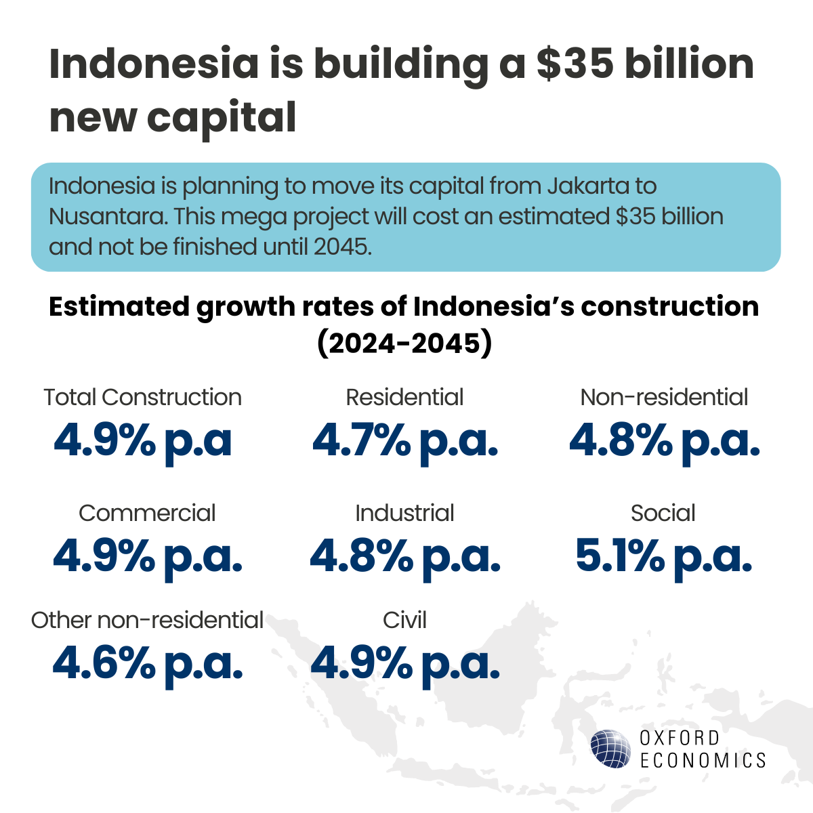
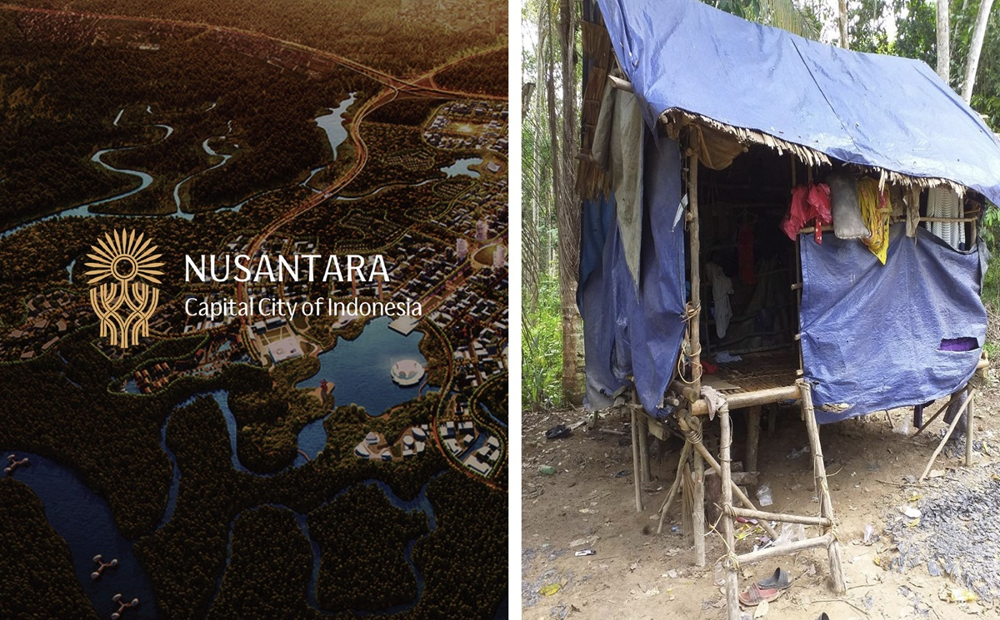
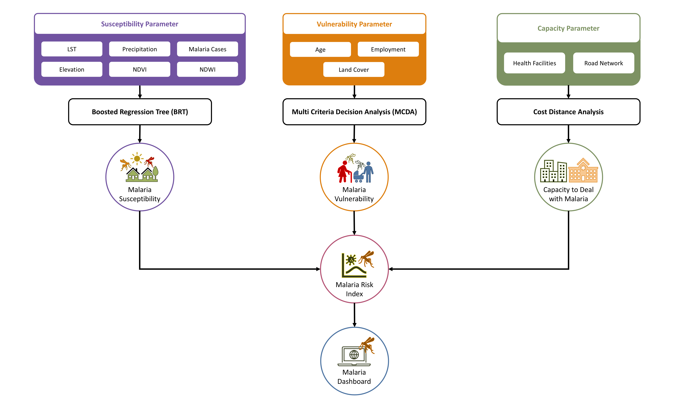
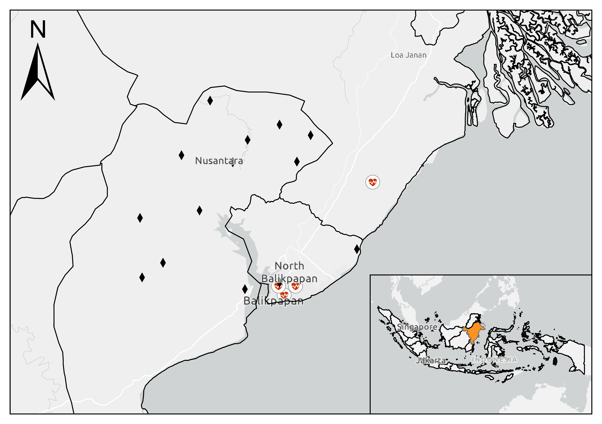
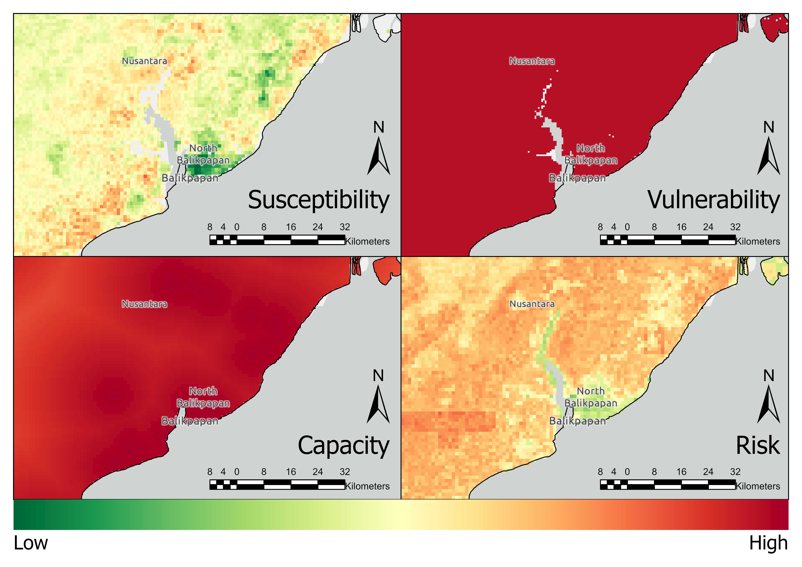
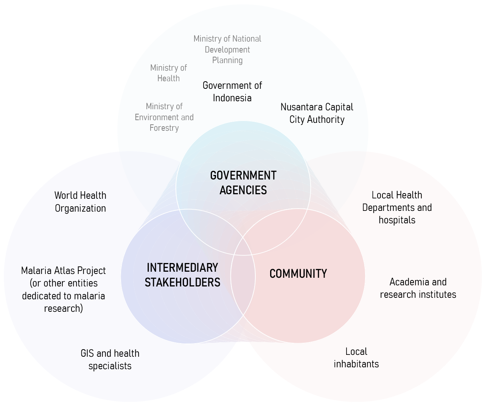
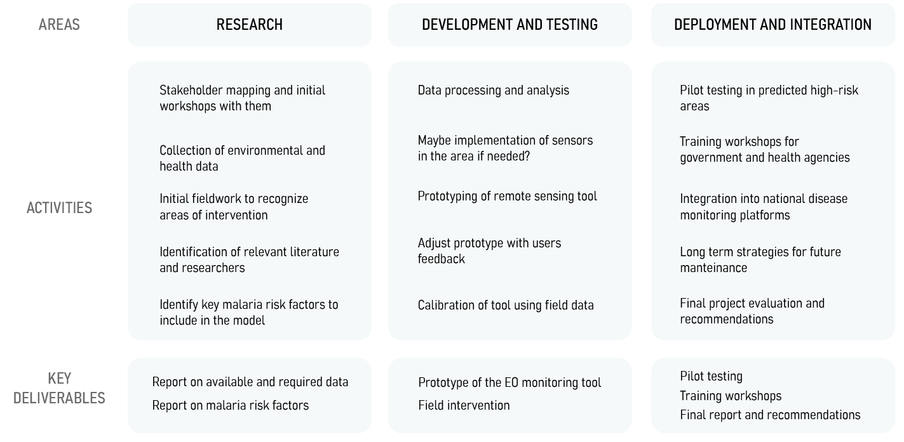
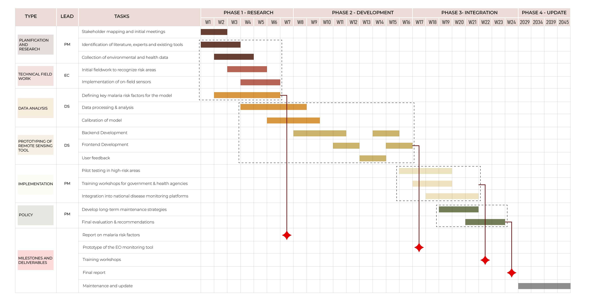
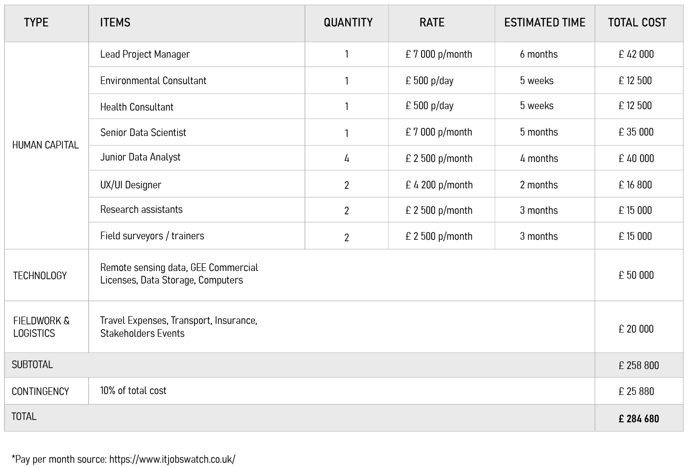

```{css, echo=FALSE}
.title-slide {
  background-image: url("images/option1.jpg"); /* Change background image */
  background-size: cover;
  background-position: center;
}

```{css, echo=FALSE}
.title-slide h1 {  
  font-size: 50px;  /* Change title size */
  line-height: 10px; /* Spacing */
}

.title-slide h2 {  
  font-size: 30px;  /* Change subtitle size */
  line-height: 10px;  
}

.title-slide h3 {  
  font-size: 25px;  /* Change author size */
  line-height: 20px;  
}

.title-slide p {  
  font-size: 20px;  /* Change date size */
  line-height: 10px;  
}

```{r xaringan-panelset, echo=FALSE}
xaringanExtra::use_panelset() 
```


```{r xaringan-themer, include=FALSE, warning=FALSE}
library(xaringanthemer)
style_mono_accent(  #we can change it to anything you prefer
  base_color = "#7f2200",
  header_font_google = google_font("Lato"),
  text_font_google   = google_font("Montserrat", "300", "300i"),
  code_font_google   = google_font("Fira Mono")
)
```

<!-- I suggest we change the title to something more specif, what do you think of this? Malaria’s Shadow Over Nusantara: Safeguarding Development with Earth Observation what do you think of this title? -->

## Malaria: A Persistent Global Challenge

Malaria remains one of the world’s most severe public health threats, affecting millions annually.


.pull-left[
According to the **WHO’s World Malaria Report 2024:**
- 263 million estimated cases worldwide in 2023, up by 11 million in 2022.

- Indonesia has the 2nd highest malaria cases in East Asia Region.

- The disease's global impact is worsened by factors like climate change, population movement, and health service disruptions.

]
--
.pull-right[

<figcaption style="text-align: center; font-size: 12px;">
 <a href="https://www.oxfordeconomics.com/resource/a-capital-is-born-the-impact-of-indonesia-moving-its-capital-city/
">Source: Oxford Economics</a>
</figcaption>
]

---


## Background Research and Framing

<div style="font-size: 12px; line-height: 1.5;">
    <div class="pull-left">
        <div style="font-size: 14px"><strong>Environmental Context</strong></div>
        <hr />
        <ul>
            <li>Nusantara’s construction clears rainforests and wetlands, creating mosquito breeding sites.</li>
            <li>Deforestation increases malaria risk by altering habitats (Bauhoff & Busch, 2020; Fornace et al., 2021).</li>
            <li>East Kalimantan lost 20% tree cover between 2001 and 2022 (Global Forest Watch, 2023).</li>
        </ul>
    </div>
    <div class="pull-right">
        <div style="font-size: 14px"><strong>Health Context</strong></div>
        <hr />
        <ul>
            <li>As a new city, Nusantara may lack robust health systems for malaria surveillance and treatment, potentially straining East Kalimantan’s existing infrastructure.</li>
            <li>East Kalimantan’s Annual Parasite Index (API) was 1.23 in 2020, significantly higher than the 0.13 API for South, West, North, and Central Kalimantan combined (Sugiarto et al., 2022).</li>
        </ul>
    </div>
    <div class="pull-right">
        <div style="font-size: 14px"><strong>Economic Context</strong></div>
        <hr />
        <ul>
            <li>Uncontrolled malaria could undermine Nusantara’s appeal to investors and residents, stunting its economic potential.</li>
            <li>Sarma et al. (2019) estimates that every $1 spent on malaria control can yield $4–$14 in economic benefits through enhanced productivity and reduced healthcare spending.</li>
                        <li>Ghana lost about US$6.58 million to malaria in 2014 (Nonvignon et al., 2016).</li>

        </ul>
    </div>
</div>

<div style="font-size: 12px; line-height: 1.5;">
    <div class="pull-left">
        <div style="font-size: 14px"><strong>Social Context</strong></div>
        <hr />
        <ul>
            <li>Nusantara’s development includes a projected workforce of 300,000 construction workers (The Jakarta Post, 2020).</li>
            <li>Sugiarto et al. (2022) confirms that most malaria cases in East Kalimantan are among adult males engaged in occupational activities.</li>
            <li>Population mobility drives malaria resurgence (WHO, 2024).</li>
            <li>Similar patterns seen in Brazil’s Belo Monte Dam project (Johansen et al., 2023).</li>
        </ul>
    </div>
</div>

---
##How does this scheme fit into policy?

.panelset[
.panel[.panel-name[SDGs]
.pull-left[

* Goal 3.3 : Good Health and Wellbeing
Target :By 2030, end the epidemics of AIDS, tuberculosis, malaria and neglected tropical diseases and combat hepatitis, water-borne diseases and other communicable diseases

* Goal 11 : Sustainable city and community
Target 11.3: By 2030, enhance inclusive and sustainable urbanization and capacity for participatory, integrated and sustainable human settlement planning and management in all countries
]
.pull-right[

]
]
.panel[.panel-name[WHO Framework]
.pull-left[
* Global Technical Strategy for Malaria (2026-2030)
* Pillar 1 : Ensure access to malaria prevention, diagnosis and treatment as part of universal health coverage.
Countries should collect data across all settings, including those areas that are malaria-free but at risk of re-establishment of malaria .


* Pillar 3. Transform malaria surveillance into a key intervention.
Surveillance in areas of high & low transmission and in areas targeted for elimination
]

.pull-right[

]
]

.panel[.panel-name[National Level]
.pull-left[
(National Action Plan for Acceleration of Malaria Elimination 2020-2026)
* Malaria elimination policies and implementation need basic research, operational support, and efficient technology development (p.53)

* Planning and implementing malaria elimination activities are based on district endemicity (p.53) stratification. 

* Allocating funds from the central government to improve case finding, surveillance and vector control around Nusantara area (p.48)

]
.pull-right[


]
]
.panel[.panel-name[Provincial Level]
.pull-left[
* Governor Regulation on Guidelines for Malaria Elimination)
* Suppress the endemic incidents (high and medium risk)
* Eliminate the number of incidents 
* Maintain free malaria status (low-none risk)

]
.pull-right[

]
]
]
---
## Framework



<!-- Note for Jasmin: why Euclidean distance not actual street Network?-->


---

## Raster Data

| No | Data         | Product  | Band                 | Spatial Resolution | Time |
|----|------------- |--------- |----------------------|--------------------|------|
| 1  | Elevation    | ALOS DSM | DSM                  | 30 m               | 2011 |
| 2  | LST          | MODIS    | LST_Day_1km          | 1000 m             | 2024 |
| 3  | Land Cover   | ESRI     | Annual Land Cover    | 10 m               | 2023 |
| 4  | NDVI         | MODIS    | NDVI                 | 500 m              | 2024 |
| 5  | NDWI         | MODIS    | NDWI                 | 463.3 m            | 2023 |
| 6  | Precipitation| CHIRPS   | Precipitation        | 5566 m             | 2024 |
| 7  | Age          | Worldpop | M_0 – M_15, M_60 – M_80, F_0 – F_15, F_60 – F_80 | 92.77 m | 2020 |

---

## Vector Data

| No | Data                   | Product               | Type    | Time |
|----|------------------------|-----------------------|---------|------|
| 1  | Health Facility        | Open Street Map       | Points  | 2024 |
| 2  | Malaria Cases          | SISMAL Indonesia      | Points  | 2024 |
| 3  | Road Networks          | Open Street Map       | Line    | 2024 |
| 4  | Employment             | Central Bureau of Statistics Indonesia | Polygon | 2024 |
| 5  | Administration Boundary | Indonesia Geospatial Agency| Polygon  | 2018 |

<div style="text-align: center;">
  
</div>

---

## Methodology

##### Tools = Google Earth Engine (GEE)

$$
Malaria\ Risk\ Index = \frac{Susceptibility + Vulnerability + Capacity}{3}
$$

.panelset[
.panel[.panel-name[Susceptibility]
* Extract LST, Precipitation, NDVI, and NDWI data and filter it for summer period (April - September) and minimum cloud cover
* Get the mean value of each LST, Precipitation, NDVI, and NDWI
* Divide the Malaria Cases Point for training and testing data
* Apply Boosted Regression Tree machine learning algorithm to get the susceptibility index
]

.panel[.panel-name[Vulnerability]
* Extract Land Cover Data and classify it into vulnerability scores
* Extract vulnerable population by age (0-15 and >60)
* Sum the vulnerable population
* Classify employment data to field and inside building and gives score 1 and 0, respectively
* Apply Fuzzy Logic Model (FLM) to normalize the value of vulnerable population to 0-1
* Apply Multi Criteria Decision Analysis (MCDA) to get the vulnerable index
]

.panel[.panel-name[Capacity]
* Extract hospital location point and road networks from Open Street Map (OSM)
* Calculate distance using Cost Distance Analysis
* Apply Fuzzy Logic Model (FLM) to normalize the value of distance to 0-1
]
]
---

## Sample Maps Preview

<div style="text-align: center;">
  
</div>

---


##Sample Dashboard 
Placeholder for an interactive dashboard. 

I tested flexdashboard r package but it's a bit complicated for the purpose of the demo so i'll go back to the initail idea of just using figma


---
##Stakeholder mapping

.panelset[
.panel[.panel-name[Government Agencies]
.pull-left[

* Regulation and alignment with national health and sustainable development policies

* Definition of intervention strategies and allocation of state funding

* Coordination with international organizations

* Implementation of environmental and urban regulations in Nusantara
]
.pull-right[

]
]

.panel[.panel-name[Community]
.pull-left[
* Active input during fieldwork regarding social practices 

* Validation of epidemiological and environmental data through fieldwork

* Implementation of disease monitoring and control strategies at the local level including 

* Capacity building and training for healthcare professionals and policymakers

* Exchange of results and research
]
.pull-right[

]
]

.panel[.panel-name[Intermediary stakeholders]
.pull-left[
* Establishing international standards and guidelines for malaria monitoring

* Providing technical assistance and future funding

* Supporting research, advocacy, and awareness campaigns

* Development of monitoring tools
]
.pull-right[

]
]

]

---
##Project workflow

---
##Timeline

---

##Budget

<div style="text-align: center;">
  
</div>

---
## References
<div style="font-size: 10px;">
<p>Bauhoff, S., & Busch, J. (2020). Does deforestation increase malaria prevalence? Evidence from satellite data and health surveys. World Development, 127, 104734-. https://doi.org/10.1016/j.worlddev.2019.104734</p>

<p>Fornace, K. M., Diaz, A. V., Lines, J., & Drakeley, C. J. (2021). Achieving global malaria eradication in changing landscapes. Malaria Journal, 20(1), 69–14. https://doi.org/10.1186/s12936-021-03599-0</p>

<p> Global Forest Watch. (2023). Forest Change. Available from: https://www.globalforestwatch.org/dashboards/country/IDN/15/?category=forest-change </p>

<p>Johansen, I. C., Moran, E. F., & Ferreira, M. U. (2023). The impact of hydropower dam construction on malaria incidence: Space-time analysis in the Brazilian Amazon. PLOS Global Public Health, 3(3), e0001683–e0001683. https://doi.org/10.1371/journal.pgph.0001683</p>

<p>Nonvignon, J., Aryeetey, G. C., Malm, K. L., Agyemang, S. A., Aubyn, V. N. A., Peprah, N. Y., Bart-Plange, C. N., & Aikins, M. (2016). Economic burden of malaria on businesses in Ghana: a case for private sector investment in malaria control. Malaria Journal, 15(1), 454–454. https://doi.org/10.1186/s12936-016-1506-0</p>

<p>Sarma, N., Patouillard, E., Cibulskis, R. E., & Arcand, J.-L. (2019). The economic burden of Malaria: Revisiting the evidence. The American Journal of Tropical Medicine and Hygiene, 101(6), 1405–1415. https://doi.org/10.4269/ajtmh.19-0386</p>

<p>Sugiarto, S. R., Baird, J. K., Singh, B., Elyazar, I., & Davis, T. M. E. (2022). The history and current epidemiology of malaria in Kalimantan, Indonesia. Malaria Journal, 21(1), 1–327. https://doi.org/10.1186/s12936-022-04366-5</p>

<p>The Jakarta Post (2020). New capital city development requires 300,000 construction workers. Available from: https://www.thejakartapost.com/news/2020/02/26/new-capital-city-development-requires-300000-construction-workers.html</p>

<p>World Health Organization (WHO). (2024). World malaria report 2024. Available from: https://www.who.int/teams/global-malaria-programme/reports/world-malaria-report-2024 </p>
</div>

