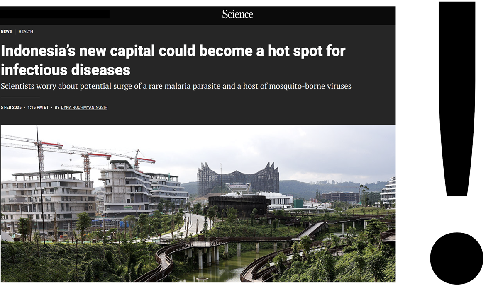

```{css, echo=FALSE}
.title-slide {
  background-image: url("images/option1.jpg"); /* Change background image */
  background-size: cover;
  background-position: center;
}

```{css, echo=FALSE}
.title-slide h1 {  
  font-size: 50px;  /* Change title size */
  line-height: 10px; /* Spacing */
}

.title-slide h2 {  
  font-size: 30px;  /* Change subtitle size */
  line-height: 10px;  
}

.title-slide h3 {  
  font-size: 25px;  /* Change author size */
  line-height: 20px;  
}

.title-slide p {  
  font-size: 20px;  /* Change date size */
  line-height: 10px;  
}

```{r xaringan-panelset, echo=FALSE}
xaringanExtra::use_panelset() 
```


```{r xaringan-themer, include=FALSE, warning=FALSE}
library(xaringanthemer)
style_mono_accent(  #we can change it to anything you prefer
  base_color = "#7f2200",
  header_font_google = google_font("Lato"),
  text_font_google   = google_font("Montserrat", "300", "300i"),
  code_font_google   = google_font("Fira Mono")
)
```


## Introduction
<!-- These are the main point, content and aesthetics will be enhanced -->

According to WHO’s latest World Malaria Report, there were almost 263 million estimated malaria cases and 597,000 malaria deaths worldwide in 2023 - **an increase of 11 million cases compared with 2022**

.pull-left[
Graph showing Indonesia's status (to be added)

]

.pull-right[
*Global Technical Strategy for Malaria 2016–2030 (GTS) *
- Indonesia was the only country in the region that had an increase in mortality rate of less than 25% 
- counter to GTS goals and regional progress
]


---
##Indonesia’s new capital city 
<!-- These are the main point, content and aesthetics will be enhanced -->


Nusantara, although currently malaria-free, remains at risk for transmission due to high population movement from surrounding high malaria endemic

- A 2020 assessment of IKN by the National Planning and Development Agency highlighted the risks, citing data including the abundance of disease-carrying mosquitoes. 

* to be added: context about the new capital and its importance to the country

---
##Why Addressing this issue?
* In, 2019 the population was *194.000*, but in 2045 it is projected to be 1.91 million *[10 times higher]*
.pull-left[


---
##How does this scheme fit into policy?

.panelset[
.panel[.panel-name[SDGs]
.pull-left[

* Goal 3.3 : Good Health and Wellbeing
Target :By 2030, end the epidemics of AIDS, tuberculosis, malaria and neglected tropical diseases and combat hepatitis, water-borne diseases and other communicable diseases

* Goal 11 : Sustainable city and community
Target 11.3: By 2030, enhance inclusive and sustainable urbanization and capacity for participatory, integrated and sustainable human settlement planning and management in all countries
]
.pull-right[

]
]
.panel[.panel-name[WHO Framework]
.pull-left[
* Global Technical Strategy for Malaria (2026-2030)
* Pillar 1 : Ensure access to malaria prevention, diagnosis and treatment as part of universal health coverage.
Countries should collect data across all settings, including those areas that are malaria-free but at risk of re-establishment of malaria .


* Pillar 3. Transform malaria surveillance into a key intervention.
Surveillance in areas of high & low transmission and in areas targeted for elimination
]

.pull-right[

]
]

.panel[.panel-name[National Level]
.pull-left[
(National Action Plan for Acceleration of Malaria Elimination 2020-2026)
* Malaria elimination policies and implementation need basic research, operational support, and efficient technology development (p.53)

* Planning and implementing malaria elimination activities are based on district endemicity (p.53) stratification. 

* Allocating funds from the central government to improve case finding, surveillance and vector control around Nusantara area (p.48)

]
.pull-right[


]
]
.panel[.panel-name[Provincial Level]
.pull-left[
* Governor Regulation on Guidelines for Malaria Elimination)
* Suppress the endemic incidents (high and medium risk)
* Eliminate the number of incidents 
* Maintain free malaria status (low-none risk)

]
.pull-right[

]
]
]
---
## Framework


<!-- Note for Jasmin: why Euclidean distance not actual street Network?-->


---

## Raster Data

| No | Data         | Product  | Band                 | Spatial Resolution | Time |
|----|------------- |--------- |----------------------|--------------------|------|
| 1  | Elevation    | ALOS DSM | DSM                  | 30 m               | 2011 |
| 2  | LST          | MODIS    | LST_Day_1km          | 1000 m             | 2024 |
| 3  | Land Cover   | ESRI     | Annual Land Cover    | 10 m               | 2023 |
| 4  | NDVI         | MODIS    | NDVI                 | 500 m              | 2024 |
| 5  | NDWI         | MODIS    | NDWI                 | 463.3 m            | 2023 |
| 6  | Precipitation| CHIRPS   | Precipitation        | 5566 m             | 2024 |
| 7  | Age          | Worldpop | M_0 – M_15, M_60 – M_80, F_0 – F_15, F_60 – F_80 | 92.77 m | 2020 |

---

## Vector Data

| No | Data                   | Product               | Type    | Time |
|----|------------------------|-----------------------|---------|------|
| 1  | Health Facility        | Open Street Map       | Points  | 2024 |
| 2  | Malaria Cases          | SISMAL Indonesia      | Points  | 2024 |
| 3  | Road Networks          | Open Street Map       | Line    | 2024 |
| 4  | Employment             | Central Bureau of Statistics Indonesia | Polygon | 2024 |
| 5  | Administration Boundary | Indonesia Geospatial Agency| Polygon  | 2018 |

<div style="text-align: center;">
  
</div>

---

## Methodology

##### Tools = Google Earth Engine (GEE)

$$
Malaria\ Risk\ Index = \frac{Susceptibility + Vulnerability + Capacity}{3}
$$

.panelset[
.panel[.panel-name[Susceptibility]
* Extract LST, Precipitation, NDVI, and NDWI data and filter it for summer period (April - September) and minimum cloud cover
* Get the mean value of each LST, Precipitation, NDVI, and NDWI
* Divide the Malaria Cases Point for training and testing data
* Apply Boosted Regression Tree machine learning algorithm to get the susceptibility index
]

.panel[.panel-name[Vulnerability]
* Extract Land Cover Data and classify it into vulnerability scores
* Extract vulnerable population by age (0-15 and >60)
* Sum the vulnerable population
* Classify employment data to field and inside building and gives score 1 and 0, respectively
* Apply Fuzzy Logic Model (FLM) to normalize the value of vulnerable population to 0-1
* Apply Multi Criteria Decision Analysis (MCDA) to get the vulnerable index
]

.panel[.panel-name[Capacity]
* Extract hospital location point and road networks from Open Street Map (OSM)
* Calculate distance using Cost Distance Analysis
* Apply Fuzzy Logic Model (FLM) to normalize the value of distance to 0-1
]
]
---

## Sample Maps Preview

<div style="text-align: center;">
  
</div>

---


##Sample Dashboard 
Placeholder for an interactive dashboard. 

I tested flexdashboard r package but it's a bit complicated for the purpose of the demo so i'll go back to the initail idea of just using figma


---
##Stakeholder mapping

.panelset[
.panel[.panel-name[Government Agencies]
.pull-left[

* Regulation and alignment with national health and sustainable development policies

* Definition of intervention strategies and allocation of state funding

* Coordination with international organizations

* Implementation of environmental and urban regulations in Nusantara
]
.pull-right[

]
]

.panel[.panel-name[Community]
.pull-left[
* Active input during fieldwork regarding social practices 

* Validation of epidemiological and environmental data through fieldwork

* Implementation of disease monitoring and control strategies at the local level including 

* Capacity building and training for healthcare professionals and policymakers

* Exchange of results and research
]
.pull-right[

]
]

.panel[.panel-name[Intermediary stakeholders]
.pull-left[
* Establishing international standards and guidelines for malaria monitoring

* Providing technical assistance and future funding

* Supporting research, advocacy, and awareness campaigns

* Development of monitoring tools
]
.pull-right[

]
]

]

---
##Project workflow

---
##Timeline

---

##Budget

<div style="text-align: center;">
  
</div>
