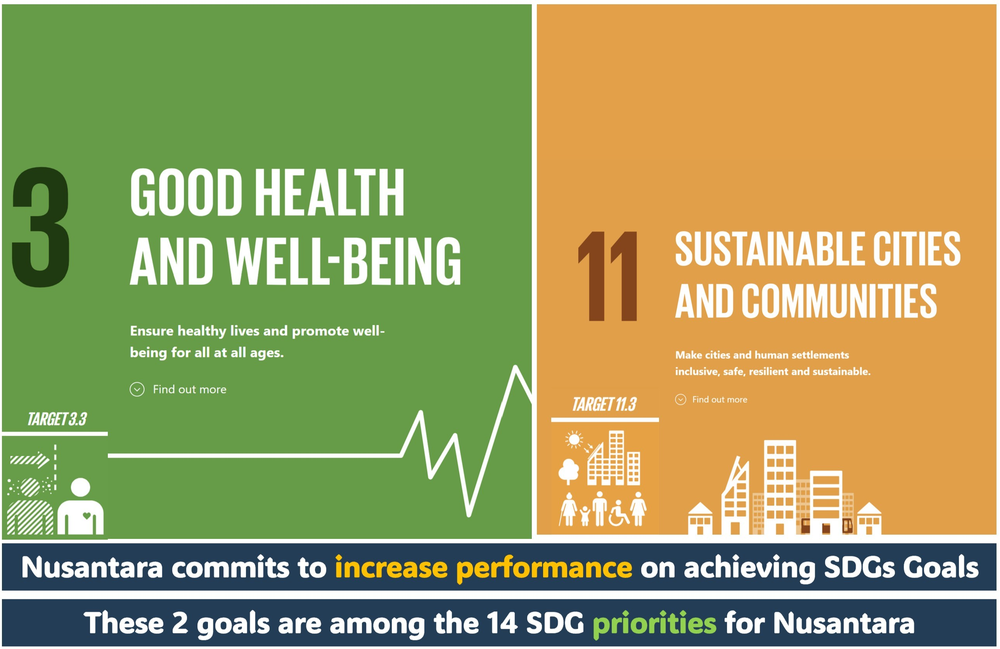
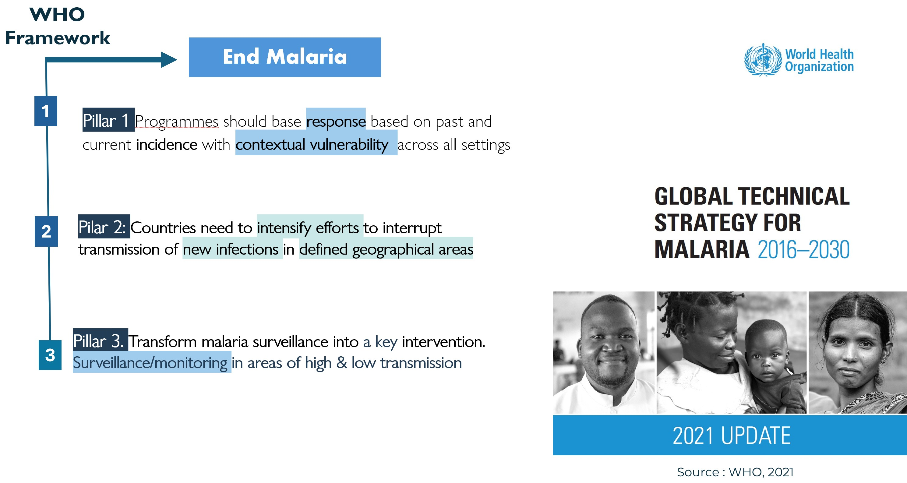
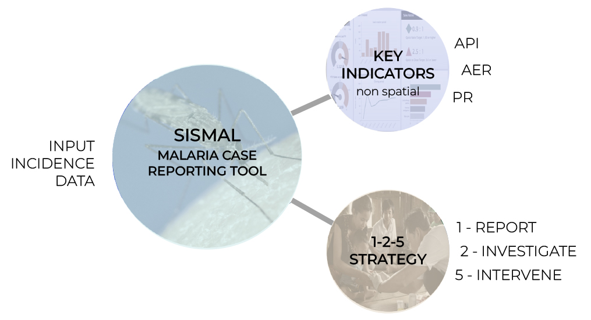
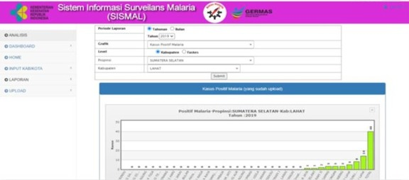
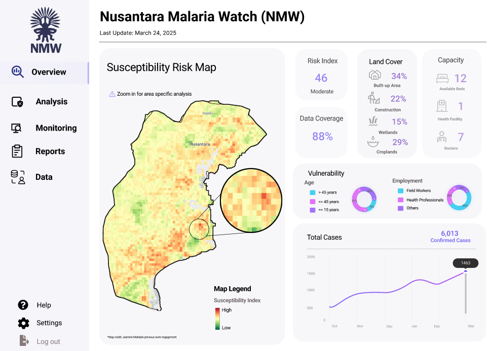
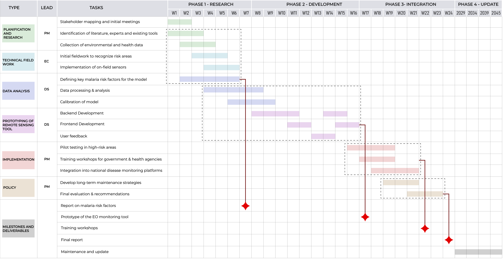
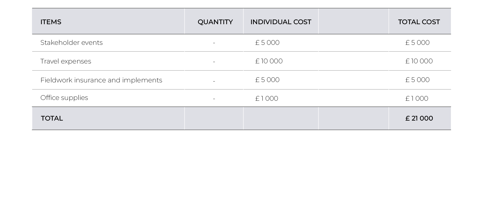

<style>
  .custom-line {
    border: 1px solid black; 
    margin-top: 1px;          
    margin-bottom: 1px;   
  }
</style>

```{r xaringan-panelset, echo=FALSE}
xaringanExtra::use_panelset() 
```


```{r xaringan-themer, include=FALSE, warning=FALSE}
library(xaringanthemer)
style_mono_accent(  #we can change it to anything you prefer
  base_color = "#353A62",
  header_font_google = google_font("Lato"),
  text_font_google   = google_font("Montserrat", "300", "300i"),
  code_font_google   = google_font("Fira Mono")
)
```

<!-- I suggest we change the title to something more specif, what do you think of this? Malaria’s Shadow Over Nusantara: Safeguarding the New Capital's Development with Earth Observation what do you think of this title? -->

## Malaria: A Persistent Global Challenge

Malaria remains one of the world’s most severe public health threats, affecting millions annually.


.pull-left[


According to the **WHO’s World Malaria Report 2024:**
<div style="text-align: justify; font-size: 16px">
- **263 million** estimated cases worldwide in 2023, up by 11 million in 2022.

- Indonesia has the **2nd highest** malaria cases in East Asia Region.

- The disease's global impact is worsened by factors like **climate change, population movement, and health service disruptions**.

]
</div>
--
.pull-right[
<!-- original source: https://assets.bwbx.io/images/users/iqjWHBFdfxIU/iSKQdPOewivM/v1/-999x-999.gif -->


<figcaption style="text-align: center; font-size: 12px;">
 <a href="https://www.bloomberg.com/news/features/2022-12-05/indonesia-s-new-rainforest-city-president-jokowi-s-nusantara-plans-face-trouble?embedded-checkout=true
">Source: Bloomberg UK</a>
</figcaption>
]

---


## Background Research and Framing

<div style="font-size: 12px; line-height: 1.5; text-align: justify">
    <div class="pull-left">
        <div style="font-size: 20px; font-weight: bold"><strong>Environmental Context</strong></div>
        <hr />
        <ul>
            <li>Nusantara’s construction clears rainforests and wetlands, <strong>creating mosquito breeding sites</strong>.</li>
            <li>Deforestation increases malaria risk by altering habitats (Bauhoff & Busch, 2020; Fornace et al., 2021).</li>
            <li>East Kalimantan, the province of the new capital, <strong>lost 20% tree cover</strong> between 2001 and 2022 (Global Forest Watch, 2023).</li>
        </ul>
    </div>
    <div class="pull-right">
        <div style="font-size: 20px; font-weight: bold"><strong>Health Context</strong></div>
        <hr />
        <ul>
            <li>As a new city, Nusantara may lack robust health systems for malaria surveillance and treatment, potentially straining existing infrastructure.</li>
            <li>East Kalimantan’s Annual Parasite Index (API) was 1.23 in 2020, significantly <strong>higher</strong> than the 0.13 API for South, West, North, and Central Kalimantan combined (Sugiarto et al., 2022).</li>
        </ul>
    </div>
    <div class="pull-right">
        <div style="font-size: 20px; font-weight: bold"><strong>Economic Context</strong></div>
        <hr />
        <ul>
            <li>Uncontrolled malaria could undermine Nusantara’s appeal to investors and residents, stunting its <strong>economic potential</strong>.</li>
            <li>Sarma et al. (2019) estimates that every $1 spent on malaria control can yield $4–$14 in economic benefits through enhanced productivity and reduced healthcare spending.</li>
            <li>Ghana lost about US$6.58 million to malaria in 2014 (Nonvignon et al., 2016).</li>
        </ul>
    </div>
</div>

<div style="font-size: 12px; line-height: 1.5;">
    <div class="pull-left">
        <div style="font-size: 20px; font-weight: bold"><strong>Social Context</strong></div>
        <hr />
        <ul>
            <li>Nusantara’s development includes a <strong>projected workforce of 300,000 construction workers</strong> (The Jakarta Post, 2020).</li>
            <li>Sugiarto et al. (2022) confirms that most malaria cases in East Kalimantan are among adult males engaged in occupational activities.</li>
            <li><strong>Population mobility</strong> drives malaria resurgence (WHO, 2024).</li>
            <li>Similar patterns seen in Brazil’s Belo Monte Dam project (Johansen et al., 2023).</li>
        </ul>
    </div>
</div>
---
.pull-center[
<div style="text-align: center;">

<div style="text-align: center;font-size: 30px">
<strong>Nusantara: A New Capital City in the Forest</strong>
</div>
<br>

<div class="image-slider">
<div></div>

</div>
</div>


.pull-left[
<div style="text-align: center;font-size: 12px">
April 26, 2022
</div>

]
.pull-right[
<div style="text-align: center;font-size: 12px">
February 19, 2024

</div>
]
<br>
<div style="font-size: 10px;text-align: center;">
 <a href="https://earthobservatory.nasa.gov/images/152471/nusantara-a-new-capital-city-in-the-forest">Source: NASA</a>
</div>

]
---


##Benefit to the city...

.panelset[
.panel[.panel-name[Global Goals : SDGs]
.pull-left[

* <span style="font-size: 90%; font-weight: bold;">Goal 3 : Good Health and Wellbeing</span> <br>
<small><span style="font-size: 75%;">Target 3.3 : **By 2030, end the epidemics** of AIDS, tuberculosis, malaria and neglected tropical diseases and combat hepatitis, water-borne diseases and other communicable diseases</span></small>

* <span style="font-size: 90%; font-weight: bold;"> Goal 11 : Sustainable city and community</span> <br>
<small><span style="font-size: 75%;">Target 11.3: By 2030, enhance inclusive and **sustainable urbanization** and capacity for participatory, integrated and sustainable **human settlement planning and management** in all countries </span></small>

]
.pull-right[

<figcaption style="text-align: center; font-size: 12px;">
 <a> Source: Nusantara Capital Authority, 2024 </a>
</figcaption>
]
]

.panel[.panel-name[WHO]


]

.panel[.panel-name[National-Provincial Goals]
.pull-left[
<small><span style="font-size: 60%;"> 
* **National Level : Action Plan for Acceleration of Malaria Elimination 2020-2026** <br>
By 2030, achieve national malaria elimination status and maintain malaria elimination (free) status </span></small>

<small><span style="font-size: 60%;">
* **Provincial Level : Governor's Regulation on Malaria Elimination**  
By 2027, eliminate malaria incidents with scenario:  
</span></small>
> <span style="font-size: 50%;">**High risk area** : Suppress to < 5 cases per 1000 people ; </span> 
> <span style="font-size: 50%;">**Medium risk area** : Eliminate to < 1 case per 1000 people ; </span>
> <span style="font-size: 50%;">**Low-none risk area** : Attain and maintain malaria-free status</span>
]

.pull-right[

<figcaption style="text-align: center; font-size: 10px;">
 <a> Source: Ministry of Health, 2023 ; Governor's Regulation 58/2023 </a>
</figcaption>
]
]

.panel[.panel-name[Local]
.pull-left[

* <span style="font-size: 100%; font-weight: bold;"> Geo-analytics technology  adoption</span> <br> <br>
<small><span style="font-size: 95%;"> Nusantara commits to implement Geo-analytic technology, not only showing digital maps but addressing city challenges with **predictive and prescriptive analysis**. </span></small> <br>


]
.pull-right[

<figcaption style="text-align: center; font-size: 12px;">
 <a> Source: OIKN, 2023 </a>
</figcaption>
]
]


]
---

class: center, middle, inverse
background-image: url("images/aereal_photo.jpg")
background-size: cover

#<span style="font-size: 50px;">Our proposal</span>


---
## Framework


---

## Raster Data

| No | Data         | Product  | Band                 | Spatial Resolution | Time |
|----|------------- |--------- |----------------------|--------------------|------|
| 1  | LST          | MODIS    | LST_Day_1km          | 1000 m             | 2025 |
| 2  | Land Cover   | Landsat  | Red, Green, Blue     | 30 m               | 2025 |
| 3  | NDVI         | Landsat  | NIR, Red             | 30 m               | 2025 |
| 4  | NDWI         | Landsat  | Green, NIR           | 30 m               | 2025 |
| 5  | Precipitation| CHIRPS   | Precipitation        | 5566 m             | 2025 |
| 6  | Age          | Worldpop | M_0 – M_15, M_60 – M_80, F_0 – F_15, F_60 – F_80 | 92.77 m | 2020 |
| 7  | Elevation    | Indonesia Geospatial Agency | DEMNAS | 8.3 m         | 2025 |

---

## Vector Data

| No | Data                   | Product               | Type    | Time |
|----|------------------------|-----------------------|---------|------|
| 1  | Health Facility        | Open Street Map       | Points  | 2025 |
| 2  | Malaria Cases          | SISMAL Indonesia      | Points  | 2025 |
| 3  | Road Networks          | Open Street Map       | Line    | 2025 |
| 4  | Employment             | Central Bureau of Statistics Indonesia | Polygon | 2025 |
| 5  | Administration Boundary | Indonesia Geospatial Agency| Polygon  | 2025 |

<div style="text-align: center;">
  
</div>
<div style="text-align: center;font-size: 12px">
Preview of vector dataset
</div>

---

## Methodology

##### Tools = Google Earth Engine (GEE)

$$
Malaria\ Risk\ Index = \frac{Susceptibility + Vulnerability + Capacity}{3}
$$

.panelset[
.panel[.panel-name[Susceptibility]
* Calculate the monthly mean of LST and Precipitation
* Calculate NDVI and NDWI from Landsat
$$
NDVI = \frac{(NIR - Red)}{(NIR + Red)}
$$
$$
NDWI = \frac{(Green - NIR)}{(Green + NIR)}
$$
* Divide the Malaria Cases Point for training and testing data
* Apply Boosted Regression Tree machine learning algorithm to get the susceptibility index
* Normalize the value result into score of 1-100 using Fuzzy Logic Model
]

.panel[.panel-name[Vulnerability]
* Classify Land Cover using Random Forest algorithm
* Extract vulnerable population by age (children: 0-15, elderly: >60)
* Sum the vulnerable population (children and elderly)
* Reclassify employment data to field officer and office worker
* Calculate the number of field officer
* Apply Fuzzy Logic Model (FLM) to normalize the value of vulnerable population and employment to 1-100
* Apply Multi Criteria Decision Analysis (MCDA) to get the vulnerability index
]

.panel[.panel-name[Capacity]
* Extract hospital location point and road networks from Open Street Map (OSM)
* Calculate distance using Cost Distance Analysis
* Apply Fuzzy Logic Model (FLM) to normalize the value of distance to 1-100
]
]
---

## Sample Maps Preview

<div style="text-align: center;">
  
</div>

---

##Limitation

1. Low spatial resolution for temperature and precipitation.

2. Malaria case points from SISMAL are based from where malaria cases were reported not from where the patient got infected with malaria.

3. The capacity analysis is not considering the availability of current prevention efforts such as insecticides, environmental modification, and bed nets.

4. The temporal resolution of Landsat limit it to monthly analysis.

5. Not updated population dataset.

##Future Updates

1. Integration with Meteorology, Climatology, and Geophysical Agency to get more accurate temperature and precipitation data.

2. Integration with Central Bureau of Statistics Indonesia to get population data per pixel.

---
## Current system for malaria elimination


.pull-left[

#### overview of current approach


<br/>

<div style="font-size: 17px;">
At the core, the malaria elimination program revolves around data obtained from malaria case incidences reported through SISMAL. 

]
</div>

.pull-right[

#### Limitations of  current approach

<div style="font-size: 18px;">

- Heavily replies on quantitative malaria case data which influences the other factors.
- Limited attention to the spatial and socio-economic dimensions.
- It primarily operates within the health sector, missing opportunities for broader cross-sectoral insights such as urban planning.
<br/>


<div style="font-size: 10px;">
Source:Nuraini et al., 2021 
]


---
## Integration of dashboard in the system

.pull-left[

####Overview of proposed approach

<div style="font-size: 16px;">


<br/>

A malaria elimination program that integrates real-time case data from SISMAL with spatial mapping via a unified dashboard.

Display key indicators (API, ABER, PR) and with dynamic visualization optimize allocation of resources and targeted interventions, reinforcing the 1‑2‑5 response strategy.

]
</div>

.pull-right[

#### Benefits of  proposed approach

<div style="font-size: 16px;">

- **Increase scope of surveillance**: case data, spatial data and socio-economic factors
- Overall strategy will be bridging  the e-health sector with relating sector to enhance the elimination process.
- Can be integrated into development of policies for make Nusantara more resistant to malaria outbreaks. 
- This aligns the health service policy to increase surveillance

]

---

##Sample Dashboard
<div style="text-align: center; height: 500px; width: 700px; margin: auto;">
    <iframe style="border: 1px solid black;" width="100%" height="100%" 
            src="https://www.figma.com/proto/PJaoJOJ3tUO0VGiwSxVpIu/CASA0023?content-scaling=fixed&embed-host=share&kind=proto&node-id=40-3&page-id=0%3A1&scaling=scale-down-width&starting-point-node-id=1%3A5&theme=light&version=2&t=vvtgpfEoNTpSJ3A8-1&hide-ui=1"></iframe>
</div>

<div style="display: flex; justify-content: space-between; font-size: 11px; margin-top: 10px;">
    <span style="text-align: left;">
        <a href="https://www.figma.com/proto/PJaoJOJ3tUO0VGiwSxVpIu/CASA0023?node-id=152-6&p=f&t=H4MuREoSWrsjWESA-1&scaling=scale-down&content-scaling=fixed&page-id=92%3A29&starting-point-node-id=152%3A6">Go to a better resolution dashboard</a>
    </span>
    
</div>

<!-- i couldn't figure out why the resolution is bad so i'm adding a link for the original Figma viewer just in case -->
---

class: center, middle, inverse
background-image: url("images/aereal_photo.jpg")
background-size: cover

#<span style="font-size: 50px;">How are we planning <br> to implement it?</span>


---

##Stakeholder mapping

.panelset[
.panel[.panel-name[Government Agencies]
.pull-left[
* <span style="font-size: 80%;"> Regulation and alignment with national health and sustainable development policies</span>

* <span style="font-size: 80%;"> Definition of intervention strategies and allocation of state funding</span>

* <span style="font-size: 80%;"> Coordination with international organizations</span>

* <span style="font-size: 80%;"> Implementation of environmental and urban regulations in Nusantara</span>

]
.pull-right[

]

]


.panel[.panel-name[Community]
.pull-left[
* <span style="font-size: 80%;">Active input during fieldwork regarding social practices </span>

* <span style="font-size: 80%;">Validation of epidemiological and environmental data through fieldwork</span>

* <span style="font-size: 80%;">Implementation of disease monitoring and control strategies at the local level including </span>

* <span style="font-size: 80%;">Capacity building and training for healthcare professionals and policymakers</span>

* <span style="font-size: 80%;">Exchange of results and research</span>
]
.pull-right[

]
]

.panel[.panel-name[Intermediary stakeholders]
.pull-left[
* <span style="font-size: 80%;">Establishing international standards and guidelines for malaria monitoring</span>

* <span style="font-size: 80%;">Providing technical assistance and future funding</span>

* <span style="font-size: 80%;">Supporting research, advocacy, and awareness campaigns</span>

* <span style="font-size: 80%;">Development of monitoring tools</span>
]
.pull-right[

]
]

]

---
background-image: url("images/phases.png")
background-size: contain
background-position: center 120px
background-repeat: no-repeat

##Phases of the project
---
##Phases of the project

.panelset[
.panel[.panel-name[Research]
.pull-left[
* <span style="font-size: 80%;">Stakeholder mapping and initial workshops with them </span>

* <span style="font-size: 80%;">Collection of environmental and health data</span>

* <span style="font-size: 80%;">Initial fieldwork to recognize areas of intervention</span>

* <span style="font-size: 80%;">Identification of relevant literature and researchers</span>

* <span style="font-size: 80%;">Identify key malaria risk factors to include in the model</span>
]
.pull-right[

**Key Deliverables**
<div class="custom-line"></div>
* <span style="font-size: 80%;">Report on malaria risk factors</span> <br><br>


]
]

.panel[.panel-name[Development]
.pull-left[
* <span style="font-size: 80%;"> Data processing and analysis</span>

* <span style="font-size: 80%;"> Implementation of sensors in the area to validate remote sensed information</span>

* <span style="font-size: 80%;"> Prototyping of remote sensing tool</span>

* <span style="font-size: 80%;"> Adjust prototype with users feedback</span>
* <span style="font-size: 80%;"> Calibration of tool using field data</span>

]
.pull-right[

**Key Deliverables**
<div class="custom-line"></div>
* <span style="font-size: 80%;">Prototype of the EO monitoring tool</span>
* <span style="font-size: 80%;">Implementation of sensors</span>
<br><br>


]
]

.panel[.panel-name[Integration]
.pull-left[
* <span style="font-size: 80%;">Pilot testing in predicted high-risk areas</span>

* <span style="font-size: 80%;">Training workshops for government and health agencies</span>

* <span style="font-size: 80%;">Integration into national disease monitoring platforms</span>

* <span style="font-size: 80%;">Long term strategies for future manteinance </span>
* <span style="font-size: 80%;">Final project evaluation and recommendations </span>

]
.pull-right[
**Key Deliverables**
<div class="custom-line"></div>
* <span style="font-size: 80%;">Training workshops</span>
* <span style="font-size: 80%;">Final report and recommendations</span>
<br><br>

<span style="font-size: 10px;"> [Source: Navig8](https://www.navig8.co.uk/annual-report-design)</span>
]
]
.panel[.panel-name[Maintenance & Update]
.pull-left[
* <span style="font-size: 80%;">Check for overall flaws and errors of the application</span>

* <span style="font-size: 80%;">Revision and maintenance of sensors </span>

* <span style="font-size: 80%;">Identify required changes depending on the changes in the city</span>

* <span style="font-size: 80%;">Main update at the beginning of each Nusantara’s project phases</span>
]
.pull-right[

**Key Deliverables**
<div class="custom-line"></div>
* <span style="font-size: 80%;">Main update in each key phase</span>
<br><br>

<span style="font-size: 10px;"> [Source: 2023 Achievement Report- Nusantara Capital Authority](https://www.ikn.go.id/storage/pedoman-nusantara/4/nca_achievement_2023.pdf)</span>

]
]

]
---
##Timeline

---

##Budget

.panelset[
.panel[.panel-name[Human Capital]


<span style="font-size: 10px;"> *Pay per month source: https://www.itjobswatch.co.uk/</span>

]

.panel[.panel-name[Technology]


]


.panel[.panel-name[Logistics]



]

.panel[.panel-name[Summary]


]
]
---

###SWOT Analysis: Proposed Malaria Risk Framework for Nusantara

---

class: center, middle, inverse
background-image: url("images/aereal_photo.jpg")
background-size: cover


---
## References
<div style="font-size: 12px;">
<p>Bauhoff, S., & Busch, J. (2020). Does deforestation increase malaria prevalence? Evidence from satellite data and health surveys. World Development, 127, 104734-. https://doi.org/10.1016/j.worlddev.2019.104734</p>

<p>Fornace, K. M., Diaz, A. V., Lines, J., & Drakeley, C. J. (2021). Achieving global malaria eradication in changing landscapes. Malaria Journal, 20(1), 69–14. https://doi.org/10.1186/s12936-021-03599-0</p>

<p> Global Forest Watch. (2023). Forest Change. Available from: https://www.globalforestwatch.org/dashboards/country/IDN/15/?category=forest-change </p>

<p>Indonesian National Capital Authority (2023). 2023 Achievement Report- Nusantara Capital Authority. Available at: https://www.ikn.go.id/storage/pedoman-nusantara/4/nca_achievement_2023.pdf</p>

<p>Johansen, I. C., Moran, E. F., & Ferreira, M. U. (2023). The impact of hydropower dam construction on malaria incidence: Space-time analysis in the Brazilian Amazon. PLOS Global Public Health, 3(3), e0001683–e0001683. https://doi.org/10.1371/journal.pgph.0001683</p>

<p>Kabaria, C.W. et al. (2016) ‘Mapping intra-urban malaria risk using high resolution satellite imagery: a case study of Dar es Salaam’, International Journal of Health Geographics, 15(1), p. 26. Available at: https://doi.org/10.1186/s12942-016-0051-y.</p>

<p>Ministry of Health, D. G. of D. P. and C. (2023) National Action Plan for Acceleration of Malaria Elimination 2020-2026  (Revision). Ministry of Health. Available at: https://malaria.kemkes.go.id/sites/default/files/2024-08/National%20Strategic%20Plan%20Revision_Malaria_29%20Mei%202023.pdf.<p>

<p>Nonvignon, J., Aryeetey, G. C., Malm, K. L., Agyemang, S. A., Aubyn, V. N. A., Peprah, N. Y., Bart-Plange, C. N., & Aikins, M. (2016). Economic burden of malaria on businesses in Ghana: a case for private sector investment in malaria control. Malaria Journal, 15(1), 454–454. https://doi.org/10.1186/s12936-016-1506-0</p>

<p>Nusantara Capital Authority (2024) Nusantara Sustainable Development GOals (SDGs) Voluntary Local Review Baseline. Jakarta: Nusantara Capital Authority. Available at: https://ikn.go.id/storage/pedoman-nusantara/2/nusantara-vlr-baseline-en.pdf.<p>

---
<div style="font-size: 10px;">
<br><br><br><br><br><br>


<p> OIKN (2023) Nusantara Smart City Blueprint. Jakarta. Available at: https://www.ikn.go.id/storage/thd/blueprint/cetak_biru_kota_cerdas_nusantara.pdf.</p>

<p>Parselia, E. et al. (2019) ‘Satellite Earth Observation Data in Epidemiological Modeling of Malaria, Dengue and West Nile Virus: A Scoping Review’, Remote Sensing, 11(16), p. 1862. Available at: https://doi.org/10.3390/rs11161862.</p>

<p> Regulation of The Governor of East Kalimantan Number 58 Of 2023 On Guidelines For Malaria Elimination Implementation </p>

<p>Sarma, N., Patouillard, E., Cibulskis, R. E., & Arcand, J.-L. (2019). The economic burden of Malaria: Revisiting the evidence. The American Journal of Tropical Medicine and Hygiene, 101(6), 1405–1415. https://doi.org/10.4269/ajtmh.19-0386</p>

<p>Sugiarto, S. R., Baird, J. K., Singh, B., Elyazar, I., & Davis, T. M. E. (2022). The history and current epidemiology of malaria in Kalimantan, Indonesia. Malaria Journal, 21(1), 1–327. https://doi.org/10.1186/s12936-022-04366-5</p>

<p>The Jakarta Post (2020). New capital city development requires 300,000 construction workers. Available from: https://www.thejakartapost.com/news/2020/02/26/new-capital-city-development-requires-300000-construction-workers.html</p>

<p>World Health Organization (WHO). (2024). World malaria report 2024. Available from: https://www.who.int/teams/global-malaria-programme/reports/world-malaria-report-2024 </p>

<p>World Health Organization (2021) Global technical strategy for malaria 2016–2030, 2021 update. Geneva: WHO. Available at: https://www.who.int/publications/i/item/9789240031357. </p></div>


