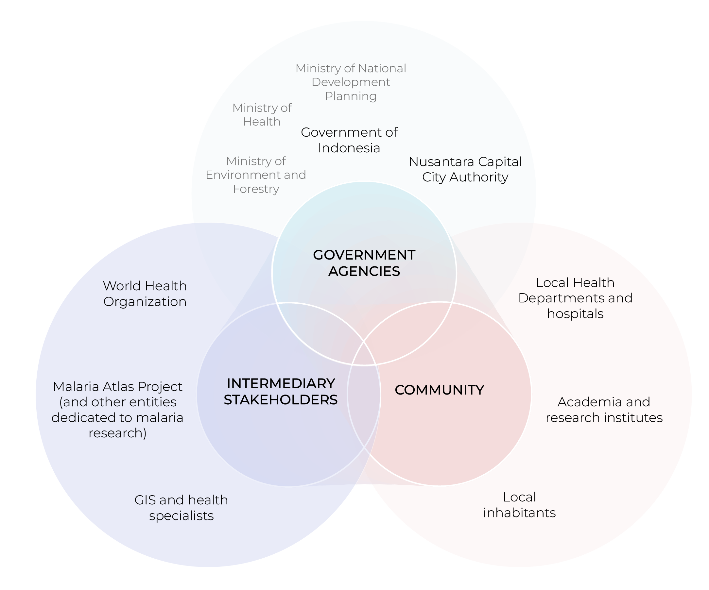

```{r xaringan-panelset, echo=FALSE}
xaringanExtra::use_panelset() 
```


```{r xaringan-themer, include=FALSE, warning=FALSE}
library(xaringanthemer)
style_mono_accent(  #we can change it to anything you prefer
  base_color = "#7f2200",
  header_font_google = google_font("Lato"),
  text_font_google   = google_font("Montserrat", "300", "300i"),
  code_font_google   = google_font("Fira Mono")
)
```

<!-- I suggest we change the title to something more specif, what do you think of this? Malaria’s Shadow Over Nusantara: Safeguarding the New Capital's Development with Earth Observation what do you think of this title? -->

## Malaria: A Persistent Global Challenge

Malaria remains one of the world’s most severe public health threats, affecting millions annually.


.pull-left[
According to the **WHO’s World Malaria Report 2024:**
- 263 million estimated cases worldwide in 2023, up by 11 million in 2022.

- Indonesia has the 2nd highest malaria cases in East Asia Region.

- The disease's global impact is worsened by factors like climate change, population movement, and health service disruptions.

]
--
.pull-right[
<div style="text-align: center;">
<!-- original source: https://assets.bwbx.io/images/users/iqjWHBFdfxIU/iSKQdPOewivM/v1/-999x-999.gif -->


<figcaption style="text-align: center; font-size: 12px;">
 <a href="https://www.bloomberg.com/news/features/2022-12-05/indonesia-s-new-rainforest-city-president-jokowi-s-nusantara-plans-face-trouble?embedded-checkout=true
">Source: Bloomberg UK</a>
</figcaption>
]

---


## Background Research and Framing

<div style="font-size: 12px; line-height: 1.5;">
    <div class="pull-left">
        <div style="font-size: 14px"><strong>Environmental Context</strong></div>
        <hr />
        <ul>
            <li>Nusantara’s construction clears rainforests and wetlands, creating mosquito breeding sites.</li>
            <li>Deforestation increases malaria risk by altering habitats (Bauhoff & Busch, 2020; Fornace et al., 2021).</li>
            <li>East Kalimantan lost 20% tree cover between 2001 and 2022 (Global Forest Watch, 2023).</li>
        </ul>
    </div>
    <div class="pull-right">
        <div style="font-size: 14px"><strong>Health Context</strong></div>
        <hr />
        <ul>
            <li>As a new city, Nusantara may lack robust health systems for malaria surveillance and treatment, potentially straining East Kalimantan’s existing infrastructure.</li>
            <li>East Kalimantan’s Annual Parasite Index (API) was 1.23 in 2020, significantly higher than the 0.13 API for South, West, North, and Central Kalimantan combined (Sugiarto et al., 2022).</li>
        </ul>
    </div>
    <div class="pull-right">
        <div style="font-size: 14px"><strong>Economic Context</strong></div>
        <hr />
        <ul>
            <li>Uncontrolled malaria could undermine Nusantara’s appeal to investors and residents, stunting its economic potential.</li>
            <li>Sarma et al. (2019) estimates that every $1 spent on malaria control can yield $4–$14 in economic benefits through enhanced productivity and reduced healthcare spending.</li>
                        <li>Ghana lost about US$6.58 million to malaria in 2014 (Nonvignon et al., 2016).</li>

        </ul>
    </div>
</div>

<div style="font-size: 12px; line-height: 1.5;">
    <div class="pull-left">
        <div style="font-size: 14px"><strong>Social Context</strong></div>
        <hr />
        <ul>
            <li>Nusantara’s development includes a projected workforce of 300,000 construction workers (The Jakarta Post, 2020).</li>
            <li>Sugiarto et al. (2022) confirms that most malaria cases in East Kalimantan are among adult males engaged in occupational activities.</li>
            <li>Population mobility drives malaria resurgence (WHO, 2024).</li>
            <li>Similar patterns seen in Brazil’s Belo Monte Dam project (Johansen et al., 2023).</li>
        </ul>
    </div>
</div>

---
.pull-center[
<div style="text-align: center;">

<div style="text-align: center;font-size: 30px">
<strong>Nusantara: A New Capital City in the Forest</strong>
</div>
<br>

<div class="image-slider">
<div></div>

</div>
</div>


.pull-left[
<div style="text-align: center;font-size: 12px">
April 26, 2022
</div>

]
.pull-right[
<div style="text-align: center;font-size: 12px">
February 19, 2024

</div>
]
<br>
<div style="font-size: 10px;text-align: center;">
 <a href="https://earthobservatory.nasa.gov/images/152471/nusantara-a-new-capital-city-in-the-forest">Source: NASA</a>
</div>

]
---


##What benefit does it bring to the city?

.panelset[
.panel[.panel-name[Global Goals : SDGs]
.pull-left[

* <span style="font-size: 90%; font-weight: bold;">Goal 3 : Good Health and Wellbeing</span> <br>
<small><span style="font-size: 75%;">Target 3.3 : **By 2030, end the epidemics** of AIDS, tuberculosis, malaria and neglected tropical diseases and combat hepatitis, water-borne diseases and other communicable diseases</span></small>

* <span style="font-size: 90%; font-weight: bold;"> Goal 11 : Sustainable city and community</span> <br>
<small><span style="font-size: 75%;">Target 11.3: By 2030, enhance inclusive and **sustainable urbanization** and capacity for participatory, integrated and sustainable **human settlement planning and management** in all countries </span></small>

]
.pull-right[


]
]

.panel[.panel-name[WHO Framework]


]

.panel[.panel-name[National-Provincial Goals]
.pull-left[
<small><span style="font-size: 60%;"> 
* **National Level : Action Plan for Acceleration of Malaria Elimination 2020-2026** <br>
By 2030, achieve national malaria elimination status and maintain malaria elimination (free) status </span></small>

<small><span style="font-size: 60%;">
* **Provincial Level : Governor's Regulation on Malaria Elimination**  
By 2027, eliminate malaria incidents with scenario:  
</span></small>
> <span style="font-size: 50%;">**High risk area** : Suppress to < 5 cases per 1000 people ; </span> 
> <span style="font-size: 50%;">**Medium risk area** : Eliminate to < 1 case per 1000 people ; </span>
> <span style="font-size: 50%;">**Low-none risk area** : Attain and maintain malaria-free status</span>
]

.pull-right[

<figcaption style="text-align: center; font-size: 12px;">
 <a> Source: Action Plan, 2023 ; Governor's Regulation 58/2023 </a>
</figcaption>
]
]

]

---
## Framework


---

## Raster Data

| No | Data         | Product  | Band                 | Spatial Resolution | Time |
|----|------------- |--------- |----------------------|--------------------|------|
| 1  | Elevation    | ALOS DSM | DSM                  | 30 m               | 2011 |
| 2  | LST          | MODIS    | LST_Day_1km          | 1000 m             | 2024 |
| 3  | Land Cover   | ESRI     | Annual Land Cover    | 10 m               | 2023 |
| 4  | NDVI         | MODIS    | NDVI                 | 500 m              | 2024 |
| 5  | NDWI         | MODIS    | NDWI                 | 463.3 m            | 2023 |
| 6  | Precipitation| CHIRPS   | Precipitation        | 5566 m             | 2024 |
| 7  | Age          | Worldpop | M_0 – M_15, M_60 – M_80, F_0 – F_15, F_60 – F_80 | 92.77 m | 2020 |

---

## Vector Data

| No | Data                   | Product               | Type    | Time |
|----|------------------------|-----------------------|---------|------|
| 1  | Health Facility        | Open Street Map       | Points  | 2024 |
| 2  | Malaria Cases          | SISMAL Indonesia      | Points  | 2024 |
| 3  | Road Networks          | Open Street Map       | Line    | 2024 |
| 4  | Employment             | Central Bureau of Statistics Indonesia | Polygon | 2024 |
| 5  | Administration Boundary | Indonesia Geospatial Agency| Polygon  | 2018 |

<div style="text-align: center;">
  
</div>

---

## Methodology

##### Tools = Google Earth Engine (GEE)

$$
Malaria\ Risk\ Index = \frac{Susceptibility + Vulnerability + Capacity}{3}
$$

.panelset[
.panel[.panel-name[Susceptibility]
* Extract LST, Precipitation, NDVI, and NDWI data and filter it for summer period (April - September) and minimum cloud cover
* Get the mean value of each LST, Precipitation, NDVI, and NDWI
* Divide the Malaria Cases Point for training and testing data
* Apply Boosted Regression Tree machine learning algorithm to get the susceptibility index
]

.panel[.panel-name[Vulnerability]
* Extract Land Cover Data and classify it into vulnerability scores
* Extract vulnerable population by age (child: 0-15 and elderly: >60)
* Sum the vulnerable population
* Classify employment data to field and inside building and gives score 1 and 0, respectively
* Apply Fuzzy Logic Model (FLM) to normalize the value of vulnerable population to 0-1
* Apply Multi Criteria Decision Analysis (MCDA) to get the vulnerability index
]

.panel[.panel-name[Capacity]
* Extract hospital location point and road networks from Open Street Map (OSM)
* Calculate distance using Cost Distance Analysis
* Apply Fuzzy Logic Model (FLM) to normalize the value of distance to 0-1
]
]
---

## Sample Maps Preview

<div style="text-align: center;">
  
</div>

---


##Limitation

####1. Different time period from some data sources like elevation, land cover, NDWI, population by age, and administration boundary.

####2. Malaria case points from SISMAL are based from health facilities not from where the patient got infected with malaria.

####3. The capacity analysis is not considering the mitigation efforts.

---

##Sample Dashboard 

<iframe src="https://www.figma.com/proto/PJaoJOJ3tUO0VGiwSxVpIu/CASA0023?content-scaling=fixed&embed-host=share&kind=proto&node-id=40-3&page-id=0%3A1&scaling=scale-down&starting-point-node-id=1%3A5&theme=light&version=2&t=vvtgpfEoNTpSJ3A8-1&hide-ui=1" style="border: none; width: 800px; height: 500px;" frameborder="0"></iframe>

<!-- I'm not sure why we're getting the black border, i tied settings the margins, background, and borders but nothing seems to affect it! -->
---


##Stakeholder mapping

.panelset[
.panel[.panel-name[Government Agencies]
.pull-left[
* <span style="font-size: 80%;"> Regulation and alignment with national health and sustainable development policies</span>

* <span style="font-size: 80%;"> Definition of intervention strategies and allocation of state funding</span>

* <span style="font-size: 80%;"> Coordination with international organizations</span>

* <span style="font-size: 80%;"> Implementation of environmental and urban regulations in Nusantara</span>

]
.pull-right[

]
]

.panel[.panel-name[Community]
.pull-left[
* <span style="font-size: 80%;">Active input during fieldwork regarding social practices </span>

* <span style="font-size: 80%;">Validation of epidemiological and environmental data through fieldwork</span>

* <span style="font-size: 80%;">Implementation of disease monitoring and control strategies at the local level including </span>

* <span style="font-size: 80%;">Capacity building and training for healthcare professionals and policymakers</span>

* <span style="font-size: 80%;">Exchange of results and research</span>
]
.pull-right[

]
]

.panel[.panel-name[Intermediary stakeholders]
.pull-left[
* <span style="font-size: 80%;">Establishing international standards and guidelines for malaria monitoring</span>

* <span style="font-size: 80%;">Providing technical assistance and future funding</span>

* <span style="font-size: 80%;">Supporting research, advocacy, and awareness campaigns</span>

* <span style="font-size: 80%;">Development of monitoring tools</span>
]
.pull-right[

]
]

]

---
##Project areas

---
##Timeline

---

##Budget

.panelset[
.panel[.panel-name[Human Capital]


<span style="font-size: 10px;"> *Pay per month source: https://www.itjobswatch.co.uk/</span>

]

.panel[.panel-name[Technology]


]


.panel[.panel-name[Logistics]


]

.panel[.panel-name[Summary]


]
]
---
## Integration of dashboard in the system

.pull-left[

SISMAL (Sistem Informasi Malaria) is the, currently system for monitoring malaria in Indonesia.

.panelset[
.panel[.panel-name[Current Monitoring systems]
* It is a web-based system that allows for real-time data entry and reporting.
* It is used by health facilities to report malaria cases.
* 1-2-5 Strategy: Case reported on Day 1, investigated on Day 2, intervention by Day 5.
]

.panel[.panel-name[Challenges & Limitations]
* Incomplete reporting
* Poor internet connectivity in remote areas
* Limited training on using the system.
]
]
]

.pull-right[


<br/>


]
---

## Integration of dashboard in the system


.panelset[
.panel[.panel-name[Short Term]

]

.panel[.panel-name[Long Term]

]


]

---
## References
<div style="font-size: 10px;">
<p>Bauhoff, S., & Busch, J. (2020). Does deforestation increase malaria prevalence? Evidence from satellite data and health surveys. World Development, 127, 104734-. https://doi.org/10.1016/j.worlddev.2019.104734</p>

<p>Fornace, K. M., Diaz, A. V., Lines, J., & Drakeley, C. J. (2021). Achieving global malaria eradication in changing landscapes. Malaria Journal, 20(1), 69–14. https://doi.org/10.1186/s12936-021-03599-0</p>

<p> Global Forest Watch. (2023). Forest Change. Available from: https://www.globalforestwatch.org/dashboards/country/IDN/15/?category=forest-change </p>

<p>Johansen, I. C., Moran, E. F., & Ferreira, M. U. (2023). The impact of hydropower dam construction on malaria incidence: Space-time analysis in the Brazilian Amazon. PLOS Global Public Health, 3(3), e0001683–e0001683. https://doi.org/10.1371/journal.pgph.0001683</p>

<p>Kabaria, C.W. et al. (2016) ‘Mapping intra-urban malaria risk using high resolution satellite imagery: a case study of Dar es Salaam’, International Journal of Health Geographics, 15(1), p. 26. Available at: https://doi.org/10.1186/s12942-016-0051-y.</p>

<p>Nonvignon, J., Aryeetey, G. C., Malm, K. L., Agyemang, S. A., Aubyn, V. N. A., Peprah, N. Y., Bart-Plange, C. N., & Aikins, M. (2016). Economic burden of malaria on businesses in Ghana: a case for private sector investment in malaria control. Malaria Journal, 15(1), 454–454. https://doi.org/10.1186/s12936-016-1506-0</p>

<p>Parselia, E. et al. (2019) ‘Satellite Earth Observation Data in Epidemiological Modeling of Malaria, Dengue and West Nile Virus: A Scoping Review’, Remote Sensing, 11(16), p. 1862. Available at: https://doi.org/10.3390/rs11161862.</p>

<p> Regulation of The Governor of East Kalimantan Number 58 Of 2023 On Guidelines For Malaria Elimination Implementation </p>

<p>Sarma, N., Patouillard, E., Cibulskis, R. E., & Arcand, J.-L. (2019). The economic burden of Malaria: Revisiting the evidence. The American Journal of Tropical Medicine and Hygiene, 101(6), 1405–1415. https://doi.org/10.4269/ajtmh.19-0386</p>

<p>Sugiarto, S. R., Baird, J. K., Singh, B., Elyazar, I., & Davis, T. M. E. (2022). The history and current epidemiology of malaria in Kalimantan, Indonesia. Malaria Journal, 21(1), 1–327. https://doi.org/10.1186/s12936-022-04366-5</p>

<p>The Jakarta Post (2020). New capital city development requires 300,000 construction workers. Available from: https://www.thejakartapost.com/news/2020/02/26/new-capital-city-development-requires-300000-construction-workers.html</p>

<p>World Health Organization (WHO). (2024). World malaria report 2024. Available from: https://www.who.int/teams/global-malaria-programme/reports/world-malaria-report-2024 </p>

<p>World Health Organization (2021) Global technical strategy for malaria 2016–2030, 2021 update. Geneva: WHO. Available at: https://www.who.int/publications/i/item/9789240031357. </p></div>


